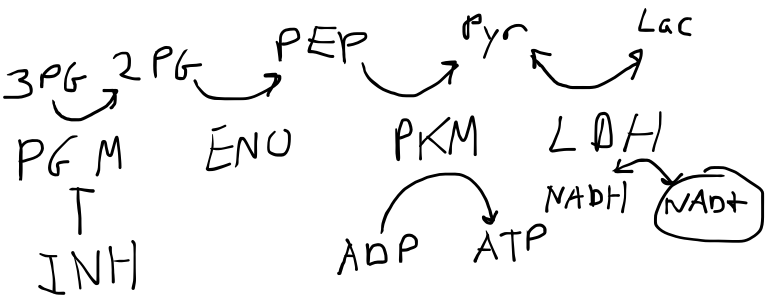
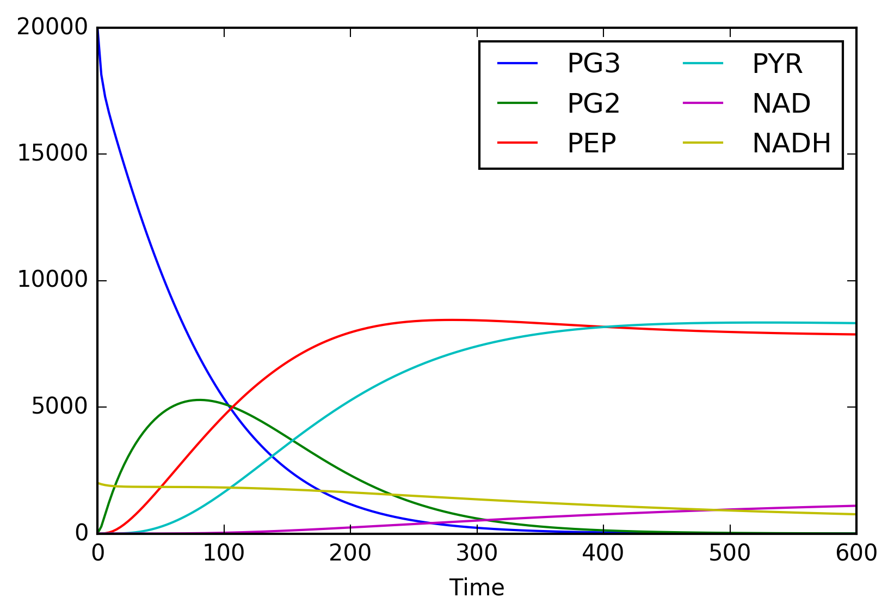

# Homework 04 - Systems biology modeling

## Due 2024-09-26 at 11:59pm

## Installing `pysb`
In order for `pysb` to work it needs `bionetgen` and `libncurses5` to be installed, and it needs to know where `bionetgen` is installed (the `BNGPATH` environment variable needs to be set). A colab notebook showing how to do this can be found [here](https://colab.research.google.com/drive/11j1e5yUmxltJ4_EMVJy_D1BB42cfckus?usp=sharing).


## Pathway modeling
Phosphoglycerate mutase 1 (PGAM1) is an important metabolic enzyme and is part of the glycotic pathway. PGAM1 is overexpressed in a number of cancers and is implicated in the metabolic reprogramming that occurs in these cells. Additionally, inhibition of PGAM1 slowed tumor growth in xenografted tumors. We'd like to identify novel inhibitors of PGAM1. Unfortunately, the biochemical assay to evaluate these inhibitors is somewhat complex, involving other enzymes and several cofactors. An expertly illustrated diagram of the pathway is shown below (see [Figure 6A](http://www.ncbi.nlm.nih.gov/pubmed/23153533) in this paper for a less artistic version and more details on the biology).


 
PGM	Phosphoglycerate mutase 1 (PGAM1) - catalyzes the conversion of 3-PG to 2-PG  
ENO	Enolase - catalyzes the conversion of 2-PG to PEP  
PKM	Pyruvate kinase - catalyzes the conversion of PEP to PYR, requires ADP  
LDH	Lactate dehydrogenase - catalyzes the conversion of PYR to LAC, requires NADH  

Note that both PEP and ADP have to bind to PKM for catalysis to occur and we will assume the products PYR and ATP disassociate from the protein when they are produced. Similarly, both PYR and NADH must bind to LDH for catalysis. According to [Wikipedia](https://en.wikipedia.org/wiki/Lactate_dehydrogenase) LDH can catalyze both directions of the reaction depending on the concentration of the substrates, so we will implement both directions (as indicated by the two-headed arrow). The inhibitor, INH, is a theoretical compound that competitively binds to the active site of PGM. What the assay measures is the conversion of NADH to NAD+ since this causes changes in absorption at 340nm. We will use [PySB](http://pysb.org/) to model this assay. With one exception (INH), we will model all the forward binding rates as having a $k_f = 10^{-5}$. All reverse binding events will have kr = 10-1 and all catalytic rates, $k_{cat}$ will also equal $10^{-1}$. Initial concentrations are as follows (note that python variables can't start with a number so we've renamed 3PG to PG3):

```python
Parameter('INH_0', 5000)
Parameter('PG3_0', 20000)
Parameter('ADP_0', 10000)
Parameter('NADH_0', 2000)
Parameter('PGM_0',5000)
Parameter('ENO_0',5000)
Parameter('PKM_0',5000)
Parameter('LDH_0',1000)
```

Your script should take as a commandline argument the $k_f$ of INH and output the value of NAD+ after 600 seconds. The beginning of your script will look like this:

```python
#!/usr/bin/env python3
#import necessary modules
from pysb import *
from pysb.macros import catalyze
from pysb.macros import catalyze_one_step
from pysb.macros import bind
from pysb.integrate import odesolve
import numpy as np
import sys
        
#set inh_kf to the first commandline argument interpreted as a float
inh_kf = float(sys.argv[1])
        
#these are our default reaction rates
kf_bind = 1e-5
kr_bind = 1e-1
kcat = 1e-1
```

and the very end of your script like this:

```python
#solve for several datapoints from 0 to 600 seconds
t = np.linspace(0,600)
out = odesolve(model, t)
#print out observables
for i in range(0,len(out),7):
    print('NAD+: %.0f  LAC: %.0f  PYR: %.0f  PEP: %.0f  PG2: %.0f  PG3: %.0f' % \
            (out['oNAD'][i],out['oLAC'][i],out['oPYR'][i],out['oPEP'][i],out['oPG2'][i],out['oPG3'][i]))
```

Here's what the curves look like with an INH $k_f$ of $10^{-5}$ (your script will only print out the final value at 600 seconds but it is informative to plot the whole trajectories):



You will submit a file named `assign.py` that takes the number in the command line (see credit sections for input and output format) and uses it as a rate constant for the simulation. 


## 50% Credit

Implement the necessary `Monomers`, `Parameters`, `Initials`, and `Observables` to represent the system. Observables should be for unbound monomers. Implement a binding rule for the inhibitor (INH) to PGAM (PGM). The $k_f$ for INH should be the value specified on the commandline (`inh_kf` above). The $k_r$ is $10^{-1}$.

```bash
$ ./assign.py 0.001
NAD+: 0  LAC: 0  PYR: 0  PEP: 0  PG2: 0  PG3: 20000
NAD+: 0  LAC: 0  PYR: 0  PEP: 0  PG2: 0  PG3: 20000
NAD+: 0  LAC: 0  PYR: 0  PEP: 0  PG2: 0  PG3: 20000
NAD+: 0  LAC: 0  PYR: 0  PEP: 0  PG2: 0  PG3: 20000
NAD+: 0  LAC: 0  PYR: 0  PEP: 0  PG2: 0  PG3: 20000
NAD+: 0  LAC: 0  PYR: 0  PEP: 0  PG2: 0  PG3: 20000
NAD+: 0  LAC: 0  PYR: 0  PEP: 0  PG2: 0  PG3: 20000
NAD+: 0  LAC: 0  PYR: 0  PEP: 0  PG2: 0  PG3: 20000
```


## 60% Credit

Implement the catalysis of 3-PG (PG3) by PGAM (PGM) to 2-PG (PG2).

```bash
$ ./assign.py 0.001
NAD+: 0  LAC: 0  PYR: 0  PEP: 0  PG2: 0  PG3: 20000
NAD+: 0  LAC: 0  PYR: 0  PEP: 0  PG2: 3516  PG3: 16095
NAD+: 0  LAC: 0  PYR: 0  PEP: 0  PG2: 6595  PG3: 13074
NAD+: 0  LAC: 0  PYR: 0  PEP: 0  PG2: 9202  PG3: 10519
NAD+: 0  LAC: 0  PYR: 0  PEP: 0  PG2: 11382  PG3: 8387
NAD+: 0  LAC: 0  PYR: 0  PEP: 0  PG2: 13179  PG3: 6631
NAD+: 0  LAC: 0  PYR: 0  PEP: 0  PG2: 14643  PG3: 5204
NAD+: 0  LAC: 0  PYR: 0  PEP: 0  PG2: 15821  PG3: 4057
```


## 70% Credit

Implement the catalysis of 2-PG (PG2) by enolase (ENO) to PEP.

```bash
$ ./assign.py 0.001
NAD+: 0  LAC: 0  PYR: 0  PEP: 0  PG2: 0  PG3: 20000
NAD+: 0  LAC: 0  PYR: 0  PEP: 1748  PG2: 1438  PG3: 16095
NAD+: 0  LAC: 0  PYR: 0  PEP: 4748  PG2: 1497  PG3: 13074
NAD+: 0  LAC: 0  PYR: 0  PEP: 7586  PG2: 1307  PG3: 10519
NAD+: 0  LAC: 0  PYR: 0  PEP: 10030  PG2: 1090  PG3: 8387
NAD+: 0  LAC: 0  PYR: 0  PEP: 12071  PG2: 892  PG3: 6631
NAD+: 0  LAC: 0  PYR: 0  PEP: 13747  PG2: 720  PG3: 5204
NAD+: 0  LAC: 0  PYR: 0  PEP: 15104  PG2: 575  PG3: 4057
```

## 80% Credit

Implement the catalysis of phosphoenolpyruvate (PEP) by pyruvate kinase (PKM) to pyruvate (PYR).

Hint: Both PKM and LDH require that both the substrate and cofactor be bound before catalysis. These bind independently in any order to the enzyme and should be modeled as such.

```bash
$ ./assign.py 0.001
NAD+: 0  LAC: 0  PYR: 0  PEP: 0  PG2: 0  PG3: 20000
NAD+: 0  LAC: 0  PYR: 370  PEP: 1055  PG2: 1438  PG3: 16095
NAD+: 0  LAC: 0  PYR: 1868  PEP: 2186  PG2: 1497  PG3: 13074
NAD+: 0  LAC: 0  PYR: 3814  PEP: 2855  PG2: 1307  PG3: 10519
NAD+: 0  LAC: 0  PYR: 5651  PEP: 3300  PG2: 1090  PG3: 8387
NAD+: 0  LAC: 0  PYR: 7151  PEP: 3695  PG2: 892  PG3: 6631
NAD+: 0  LAC: 0  PYR: 8257  PEP: 4118  PG2: 720  PG3: 5204
NAD+: 0  LAC: 0  PYR: 9003  PEP: 4587  PG2: 575  PG3: 4057
```


## 90% Credit

Implement the forward only catalysis of pyruvate (PYR) by lactate dehydrogenase (LDH) to lactate (LAC).

```bash
$ ./assign.py 0.001
NAD+: 0  LAC: 0  PYR: 0  PEP: 0  PG2: 0  PG3: 20000
NAD+: 5  LAC: 5  PYR: 342  PEP: 1055  PG2: 1438  PG3: 16095
NAD+: 71  LAC: 71  PYR: 1676  PEP: 2186  PG2: 1497  PG3: 13074
NAD+: 227  LAC: 227  PYR: 3360  PEP: 2855  PG2: 1307  PG3: 10519
NAD+: 439  LAC: 439  PYR: 4906  PEP: 3300  PG2: 1090  PG3: 8387
NAD+: 669  LAC: 669  PYR: 6122  PEP: 3695  PG2: 892  PG3: 6631
NAD+: 888  LAC: 888  PYR: 6975  PEP: 4118  PG2: 720  PG3: 5204
NAD+: 1084  LAC: 1084  PYR: 7504  PEP: 4587  PG2: 575  PG3: 4057
```


## 100% Credit

Implement the reversible catalysis of pyruvate (PYR) by lactate dehydrogenase (LDH) to lactate (LAC).

```bash
$ ./assign.py 0.001
NAD+: 0  LAC: 0  PYR: 0  PEP: 0  PG2: 0  PG3: 20000
NAD+: 5  LAC: 5  PYR: 342  PEP: 1055  PG2: 1438  PG3: 16095
NAD+: 66  LAC: 66  PYR: 1677  PEP: 2186  PG2: 1497  PG3: 13074
NAD+: 207  LAC: 209  PYR: 3367  PEP: 2855  PG2: 1307  PG3: 10519
NAD+: 394  LAC: 401  PYR: 4926  PEP: 3300  PG2: 1090  PG3: 8387
NAD+: 589  LAC: 602  PYR: 6165  PEP: 3695  PG2: 892  PG3: 6631
NAD+: 768  LAC: 788  PYR: 7046  PEP: 4118  PG2: 720  PG3: 5204
NAD+: 923  LAC: 949  PYR: 7606  PEP: 4587  PG2: 575  PG3: 4057
```